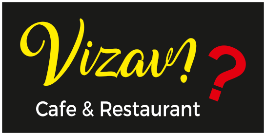

# Vizavi Cafe & Restaurant QR Menu

Complete project documentation for handoff to another AI assistant, Claude, or future developers.

Last updated: 2026-06-20

---

## 1. Project Overview

Vizavi Cafe & Restaurant QR Menu is a static, mobile-first digital restaurant menu website for customers who scan a QR code at the restaurant and browse the available dishes on their own phones.

The project exists to replace a printed menu with a premium, elegant, easy-to-maintain digital experience. It presents the restaurant brand, categories, food cards, dish images, dish descriptions, ingredients, allergen information, and prices in Turkish.

Business purpose:

- Give customers a polished QR menu experience inside the restaurant.
- Make the menu easier to update than printed material.
- Present the Vizavi brand as premium, warm, modern, and Middle Eastern/Lebanese inspired.
- Keep the flow informational and lightweight so customers can browse quickly from a phone.

User experience goal:

- A customer opens the QR menu, sees a luxury branded hero area, scrolls categories horizontally, taps a dish card, and views details in a premium mobile bottom sheet.
- The list view stays simple: cards show only the food image, dish name, and optional tag.
- Price, ingredients, allergens, and longer descriptions appear only inside the dish detail modal.

Important project boundary:

This is **not** a food ordering system. It is a QR menu only.

The project intentionally does **not** include:

- Cart
- Checkout
- Payment
- Delivery
- Order placement
- Login
- User accounts
- Quantity selectors
- Add buttons
- Any delivery-app style workflow

---

## 2. Project Vision

The desired final experience is a luxury mobile-first QR restaurant menu inspired by:

- Premium restaurant websites
- Luxury Middle Eastern and Lebanese restaurant presentation
- Modern hospitality websites
- Elegant printed menu design translated into a phone-first interface

Design goals:

- Elegant: refined typography, dark green atmosphere, gold accents, ivory content surfaces.
- Fast: static files, no heavy framework, minimal JavaScript.
- Premium: large imagery, soft shadows, rounded surfaces, smooth transitions.
- Mobile-first: optimized for phone widths first, especially 360px, 390px, and 430px.
- Easy to use: sticky category navigation, clear food cards, simple modal details.
- Informational only: a menu browsing experience, not an ordering funnel.

The visual direction should feel closer to a modern luxury restaurant website than a generic delivery menu. The interface should communicate atmosphere, quality, and hospitality while remaining practical for quick QR use.

---

## 3. Current Architecture

The current project is a plain static website built with:

- `index.html`
- `styles.css`
- `script.js`
- `images/`

There is no build step, package manager, bundler, framework, or backend.

### `index.html`

Purpose:

- Defines the static document structure.
- Loads the stylesheet using the relative path `./styles.css`.
- Loads JavaScript using the relative path `./script.js` with `defer`.
- Sets `lang="tr"` and UTF-8 encoding.
- Contains the splash screen, hero slider shell, hero brand panel, category navigation shell, menu container, dish detail modal, and fullscreen image preview shell.

Important current references:

```html
<link rel="stylesheet" href="./styles.css">
<script src="./script.js" defer></script>
```

Logo references:

```html


```

Main DOM IDs used by JavaScript:

- `#splashScreen`
- `#splashLogo`
- `#brandLogo`
- `#heroSlides`
- `#prevHero`
- `#nextHero`
- `#heroDots`
- `#exploreMenu`
- `#categoryShell`
- `#categoryBar`
- `#menuSections`
- `#dishModal`
- `#modalImageButton`
- `#modalImage`
- `#modalFallback`
- `#modalTitle`
- `#modalShortDescription`
- `#modalIngredients`
- `#modalAllergens`
- `#modalPrice`
- `#imagePreview`
- `#previewFrame`
- `#previewImage`

### `styles.css`

Purpose:

- Holds all visual styling.
- Implements the dark green luxury theme.
- Defines mobile-first responsive layout.
- Styles the splash screen, hero slider, category tabs, cards, modal bottom sheet, fullscreen preview, fallback placeholders, skeleton shimmer, and animations.

The CSS is mobile-first. Desktop media queries enhance the experience after the mobile layout is already functional.

### `script.js`

Purpose:

- Stores all menu content in one editable `menuData` array.
- Stores the hero slide data in `heroSlides`.
- Renders categories and menu sections dynamically.
- Opens and closes the dish detail modal.
- Opens and closes the fullscreen image preview.
- Handles sticky category active states with `IntersectionObserver`.
- Handles image loading states and missing-image fallbacks.
- Handles hero auto-rotation every 4 seconds.
- Handles smooth scrolling and keyboard Escape behavior.
- Initializes only after DOM is ready.

Important current initialization:

```js
if (document.readyState === "loading") {
  document.addEventListener("DOMContentLoaded", initializeMenu);
} else {
  initializeMenu();
}
```

### `images/`

Purpose:

- Stores the official Vizavi logo and future real food/hero images.
- Current committed image asset is `./images/logo.svg`.
- Food and hero image paths are already referenced in JavaScript, but real food/hero files are not present yet.
- Missing images are handled gracefully through the placeholder/fallback design.

---

## 4. Folder Structure

Current actual project folder:

```text
vizavi-menu/
|
|-- .git/
|-- index.html
|-- styles.css
|-- script.js
|-- PROJECT_DOCUMENTATION.md
|
`-- images/
    |-- .gitkeep
    `-- logo.svg
```

Referenced future image structure:

```text
vizavi-menu/
|
|-- index.html
|-- styles.css
|-- script.js
|-- PROJECT_DOCUMENTATION.md
|
`-- images/
    |-- logo.svg
    |-- hero-1.jpg
    |-- hero-2.jpg
    |-- hero-3.jpg
    |-- fetus.jpg
    |-- teboleh.jpg
    |-- cacik.jpg
    |-- mutebbel.jpg
    |-- patates-kizartmasi.jpg
    |-- falafel-ici-sumakli-sogan.jpg
    |-- falafel-ici-aci-peynir.jpg
    |-- falafel-adet.jpg
    |-- super-falafel-sandvic.jpg
    |-- falafel-sandvic.jpg
    |-- falafel-menu-porsiyon.jpg
    |-- foul-bakla-ezmesi.jpg
    |-- kudsiye.jpg
    |-- musabaha.jpg
    |-- bademli-hummus-fatte.jpg
    |-- kiymali-hummus.jpg
    |-- hummus-tabagi.jpg
    |-- buyuk-peynirli-pide-manakis.jpg
    |-- peynirli-muhammara-pide-manakis.jpg
    |-- buyuk-zahterli-peynirli-pide-manakis.jpg
    |-- buyuk-zahterli-pide-manakis.jpg
    |-- lubnan-geceleri.jpg
    |-- cola-turka-330-ml.jpg
    |-- ayran-170-ml.jpg
    |-- ayran-270-ml.jpg
    |-- sikma-portakal-suyu-330-ml.jpg
    |-- sikma-limonata-300-ml.jpg
    |-- limonlu-soda-200-ml.jpg
    |-- sade-soda-200-ml.jpg
    `-- su-500-ml.jpg
```

---

## 5. Branding

Restaurant name:

```text
Vizavi Cafe & Restaurant
```

Official logo path:

```text
./images/logo.svg
```

Brand style:

- Premium
- Elegant
- Modern
- Lebanese / Middle Eastern inspired
- Warm hospitality
- Dark green atmosphere with ivory and gold contrast

Current logo behavior:

- Used in the splash screen.
- Used in the hero section.
- Styled inside a white circular background.
- Uses `object-fit: contain`.
- Has soft shadow/glow.
- Mobile logo size is approximately 134px in splash and 146px in hero wrapper.
- Desktop logo wrapper grows to approximately 184px.
- If the logo fails to load, fallback text `Vizavi` appears.

Current CSS color palette:

| Token | Value | Usage |
|---|---:|---|
| `--green-950` | `#021c16` | Deepest background green, overlays, luxury base |
| `--green-900` | `#063d2e` | Main brand dark green |
| `--green-820` | `#0b4b38` | Secondary green gradients |
| `--green-760` | `#125c45` | Lighter green gradient stop |
| `--ivory-50` | `#fffaf0` | Light ivory text/surfaces |
| `--ivory-100` | `#f8efd8` | Card gradient surface |
| `--ivory-180` | `#f4e8c8` | Main menu background |
| `--gold-300` | `#f4d98b` | Bright gold text/accent |
| `--gold-500` | `#d8b56d` | Primary gold accent |
| `--gold-700` | `#a8782d` | Deeper gold accent |
| `--red-600` | `#a71920` | Brand red accent, currently available for future emphasis |
| `--ink` | `#251f1a` | Main dark text |
| `--muted` | `#766b61` | Secondary text |
| `--white` | `#ffffff` | Logo/card contrast |
| `--line` | `rgba(216, 181, 109, 0.34)` | Subtle gold line |
| `--shadow-card` | `0 20px 46px rgba(4, 37, 28, 0.16)` | Food card shadow |
| `--shadow-heavy` | `0 30px 90px rgba(2, 28, 22, 0.42)` | Modal/preview shadow |

Typography:

- UI/base font: `"Segoe UI", Tahoma, sans-serif`
- Display/restaurant feel: `Georgia, "Times New Roman", serif`
- The design uses zero or normal letter spacing to avoid mobile readability problems.

---

## 6. Mobile First Requirements

The project is optimized primarily for phones. Target widths:

- 360px
- 390px
- 430px

Desktop support exists, but it is secondary. This is intentional because the real use case is scanning a QR code at a table and browsing on a phone.

Current mobile-first behavior:

- Hero height is controlled so it feels strong but not excessive on phone screens.
- Sticky category bar remains accessible while scrolling.
- Category tabs scroll horizontally on mobile.
- Food cards use a 2-column grid on normal phone widths.
- Very narrow screens under 340px switch to 1 column.
- Modal opens as a bottom sheet on mobile.
- Modal content scrolls internally.
- Modal image height is constrained with `dvh` units so it does not take the entire screen.
- Close buttons are large circular touch targets.
- Text sizes are readable without zooming.

Responsive breakpoints currently used:

- `max-width: 340px`: food grid becomes 1 column.
- `max-height: 700px`: hero and modal image heights are reduced.
- `min-width: 700px`: tablet/desktop enhancements, 3-column grid, centered modal.
- `min-width: 1040px`: larger desktop container, 4-column grid, category bar can wrap/center.

Design priority:

1. Phone QR browsing
2. Tablet browsing
3. Desktop preview/support

---

## 7. Hero Section

Current implementation:

- The hero is implemented in `index.html` as `<header class="luxury-hero" id="top">`.
- The slider shell uses `#heroSlider`, `#heroSlides`, `#prevHero`, `#nextHero`, and `#heroDots`.
- Slide data is stored in `script.js` in `heroSlides`.
- Three hero slides are rendered dynamically.
- Slides auto-rotate every 4 seconds.
- Navigation arrows and dots are interactive.
- If a hero image is missing, the slide shows a dark green/gold placeholder gradient with a large fallback letter.
- A dark overlay keeps text readable over real images.

Current hero slide data:

```js
const heroSlides = [
  { image: "./images/hero-1.jpg", fallback: "V" },
  { image: "./images/hero-2.jpg", fallback: "Z" },
  { image: "./images/hero-3.jpg", fallback: "R" },
];
```

Current hero text:

```text
Vizavi Cafe & Restaurant
Lezzetin En Doğal Hali
Geleneksel tarifler, taze malzemeler ve unutulmaz bir deneyim.
```

Current hero button:

```text
Menüyü Keşfet
```

Button behavior:

- The `#exploreMenu` button scrolls smoothly to `#categoryShell`.

Desired final hero behavior:

- Keep the current hero slider.
- Replace placeholder hero files with real food or restaurant atmosphere photos.
- Keep dark green background, gold accents, large official logo, restaurant name, slogan, and scroll button.
- Keep the hero mobile-first; do not let it become a tall desktop-style landing page on phones.

Recommended real hero image types:

- Lebanese/Middle Eastern table spread
- Hummus/falafel close-up
- Warm restaurant interior or branded counter

Recommended dimensions:

- Use wide banner images around 1600x1000 or 1800x1200.
- Export compressed WebP/JPG.
- Keep focal point centered for mobile cropping.

---

## 8. Category Navigation

Current behavior:

- Category navigation is rendered dynamically from `menuData`.
- The nav shell is sticky with `position: sticky; top: 0`.
- Mobile category tabs are horizontally scrollable.
- Scrollbars are hidden for a clean QR menu feel.
- Active category is highlighted with gold styling and a gold underline.
- Clicking a category smoothly scrolls to the matching section.
- The active category updates while scrolling through sections using `IntersectionObserver`.

Current category display mapping:

| Internal category | Visible label | Icon |
|---|---|---|
| `Soğuk Mezeler Menü` | `Soğuk Mezeler` | `🍃` |
| `Sıcak Mezeler Menü` | `Sıcak Mezeler` | `🔥` |
| `Falafel Menü` | `Falafel` | `🧆` |
| `Hummus Menü` | `Hummus` | `🥣` |
| `Taş Fırında Menü` | `Taş Fırında` | `🫓` |
| `Tatlı Menü` | `Tatlı` | `🍰` |
| `İçecek Menü` | `İçecek` | `🥤` |

Current implementation details:

- Category order is derived from the order of first appearance in `menuData`.
- `slugify(category)` creates section IDs from category names.
- Each rendered category button stores the target in `button.dataset.target`.
- Each menu section uses the same slug as its `id` and `data-category`.

Desired behavior:

- Keep sticky navigation.
- Keep horizontal scrolling on mobile.
- Keep active category highlighting.
- Keep smooth scrolling.
- Keep category labels Turkish only.
- Do not add category-level order or cart controls.

---

## 9. Menu Data

Menu data is stored in `script.js` in a single flat array:

```js
const menuData = [
  {
    name: "Fetuş",
    category: "Soğuk Mezeler Menü",
    price: "₺250,00",
    image: "./images/fetus.jpg",
    shortDescription: "...",
    ingredients: ["..."],
    allergens: ["..."],
    tags: ["🌱 Vejetaryen"],
  },
];
```

Actual field names:

| Field | Type | Purpose |
|---|---|---|
| `name` | string | Dish name shown on cards and in modal |
| `category` | string | Internal category grouping |
| `price` | string | Price formatted in Turkish Lira, shown only in modal |
| `image` | string | Relative path to item image in `./images/` |
| `shortDescription` | string | Marketing description shown in modal |
| `ingredients` | string[] | Ingredient bullet list shown in modal |
| `allergens` | string[] | Allergen bullet list shown in modal |
| `tags` | string[] | Optional card tag; currently `🌱 Vejetaryen`, `⭐ Popüler`, or `🔥 Sıcak` |

Important:

- The list/card view must not show prices.
- The list/card view must not show ingredients.
- The list/card view must not show descriptions.
- Prices and details belong only inside the modal.

Current totals:

- 7 categories
- 30 menu items

### Soğuk Mezeler Menü

| Name | Price | Image | Description | Ingredients | Allergens | Tags |
|---|---:|---|---|---|---|---|
| Fetuş | ₺250,00 | `./images/fetus.jpg` | Nar ekşili ferahlığı ve çıtır dokusuyla sofraya canlı bir başlangıç katar. | Nar ekşisi; Taze sebzeler; Çıtır ekmek parçaları | Gluten içerir; Alerjen bilgisi için lütfen personele danışınız | 🌱 Vejetaryen |
| Teboleh | ₺280,00 | `./images/teboleh.jpg` | Maydanozun tazeliği, limonun parlak aroması ve ince bulgurla hafif bir mezze klasiği. | İnce bulgur; Taze maydanoz; Domates; Limon suyu | Gluten içerir; Alerjen bilgisi için lütfen personele danışınız | 🌱 Vejetaryen |
| Cacık | ₺100,00 | `./images/cacik.jpg` | Yoğurt, salatalık ve nane ile serin, dengeli ve sade bir eşlikçi. | Yoğurt; Salatalık; Sarımsak; Nane | Süt ürünleri içerir; Alerjen bilgisi için lütfen personele danışınız | 🌱 Vejetaryen |
| Mütebbel | ₺250,00 | `./images/mutebbel.jpg` | Köz patlıcanın isli aroması, tahin ve limonla kadifemsi bir mezeye dönüşür. | Pita ekmeği; Közlenmiş patlıcan; Tahin; Limon suyu | Gluten içerir; Susam içerir; Alerjen bilgisi için lütfen personele danışınız | 🌱 Vejetaryen |

### Sıcak Mezeler Menü

| Name | Price | Image | Description | Ingredients | Allergens | Tags |
|---|---:|---|---|---|---|---|
| Patates Kızartması | ₺170,00 | `./images/patates-kizartmasi.jpg` | Dışı çıtır, içi yumuşak sıcak patatesler; klasik soslarla servis edilir. | Patates; Ketçap; Mayonez | Yumurta içerebilir; Alerjen bilgisi için lütfen personele danışınız | 🔥 Sıcak |

### Falafel Menü

| Name | Price | Image | Description | Ingredients | Allergens | Tags |
|---|---:|---|---|---|---|---|
| Falafel İçi Sumaklı Soğan | ₺50,00 | `./images/falafel-ici-sumakli-sogan.jpg` | Çıtır falafel köftesi, sumaklı soğanın canlı ekşiliğiyle tek lokmalık bir lezzet sunar. | 1 adet çıtır falafel köftesi; Sumaklı soğan | Susam içerebilir; Alerjen bilgisi için lütfen personele danışınız | 🌱 Vejetaryen |
| Falafel İçi Acı Peynir | ₺57,78 | `./images/falafel-ici-aci-peynir.jpg` | Falafelin çıtır kabuğu, erimiş acı peynirle sıcak ve yoğun bir lezzete dönüşür. | 1 adet çıtır falafel köftesi; Erimiş acı peynir | Süt ürünleri içerir; Susam içerebilir; Alerjen bilgisi için lütfen personele danışınız | 🔥 Sıcak |
| Falafel (Adet) | ₺22,78 | `./images/falafel-adet.jpg` | Nohut, özel baharatlar ve otlarla hazırlanan çıtır dış yüzeyli klasik falafel. | Falafel; Nohut; Özel baharatlar; Ot | Susam içerebilir; Alerjen bilgisi için lütfen personele danışınız | 🌱 Vejetaryen |
| Süper Falafel Sandviç | ₺244,44 | `./images/super-falafel-sandvic.jpg` | Falafel, patlıcan, çıtır patates ve özel sosla doyurucu bir sokak lezzeti. | Çıtır falafel köfteleri; Patlıcan; Çıtır patates kızartması; Özel sos | Gluten içerir; Susam içerebilir; Alerjen bilgisi için lütfen personele danışınız | ⭐ Popüler |
| Falafel Sandviç | ₺220,00 | `./images/falafel-sandvic.jpg` | Taze sebzeler ve özel sosla dengelenmiş, çıtır falafelli klasik sandviç. | Çıtır falafel köfteleri; Taze sebzeler; Özel sos | Gluten içerir; Susam içerebilir; Alerjen bilgisi için lütfen personele danışınız | 🌱 Vejetaryen |
| Falafel Menü (Porsiyon) | ₺325,00 | `./images/falafel-menu-porsiyon.jpg` | Falafel, hummus ve çıtır patateslerle tabakta zengin ve dengeli bir porsiyon. | Falafel; Hummus; Çıtır patatesler; Taze sebzeler veya yeşillikler | Susam içerir; Alerjen bilgisi için lütfen personele danışınız | ⭐ Popüler |

### Hummus Menü

| Name | Price | Image | Description | Ingredients | Allergens | Tags |
|---|---:|---|---|---|---|---|
| Foul (Bakla Ezmesi) | ₺283,33 | `./images/foul-bakla-ezmesi.jpg` | Baklanın zeytinyağı, sarımsak ve limonla buluştuğu güçlü ve geleneksel bir tabak. | Fava fasulyesi; Zeytinyağı; Sarımsak; Limon; Baharat; 2 adet ekmek | Gluten içerir; Alerjen bilgisi için lütfen personele danışınız | 🌱 Vejetaryen |
| Kudsiye | ₺376,67 | `./images/kudsiye.jpg` | Hummus üzerine baharatlı fava, zeytinyağı ve taze otlarla katmanlı bir lezzet. | Hummus; Baharatlarla pişirilmiş fava fasulyesi; Zeytinyağı; Limon; Taze otlar; 2 adet ekmek | Gluten içerir; Susam içerir; Alerjen bilgisi için lütfen personele danışınız | ⭐ Popüler |
| Musabaha | ₺340,00 | `./images/musabaha.jpg` | Nohut taneleri, baharatlar ve zeytinyağıyla sıcak karakterli bir hummus yorumu. | Hummus; Nohut taneleri; Zeytinyağı; Baharatlar; 2 adet ekmek | Gluten içerir; Susam içerir; Alerjen bilgisi için lütfen personele danışınız | 🌱 Vejetaryen |
| Bademli Hummus Fatte | ₺472,22 | `./images/bademli-hummus-fatte.jpg` | Kavrulmuş badem, taze ekmek parçaları ve özel soslarla zenginleşen premium hummus. | Hummus; Kavrulmuş bademler; Taze ekmek parçaları; Özel soslar | Gluten içerir; Susam içerir; Kuruyemiş içerir; Alerjen bilgisi için lütfen personele danışınız | ⭐ Popüler |
| Kıymalı Hummus | ₺400,00 | `./images/kiymali-hummus.jpg` | Klasik hummusun üzerine baharatlı et dokunuşuyla daha yoğun ve doyurucu bir tabak. | Klasik hummus; Pişirilmiş et; Baharatlar; 2 adet ekmek | Gluten içerir; Susam içerir; Alerjen bilgisi için lütfen personele danışınız | 🔥 Sıcak |
| Hummus Tabağı | ₺300,00 | `./images/hummus-tabagi.jpg` | Zeytinyağıyla parlatılmış, pürüzsüz ve sade hummus; taze özel ekmekle servis edilir. | Hummus; Zeytinyağı; 2 adet taze özel ekmek | Gluten içerir; Susam içerir; Alerjen bilgisi için lütfen personele danışınız | 🌱 Vejetaryen |

### Taş Fırında Menü

| Name | Price | Image | Description | Ingredients | Allergens | Tags |
|---|---:|---|---|---|---|---|
| Büyük Peynirli Pide (Manakış) | ₺340,00 | `./images/buyuk-peynirli-pide-manakis.jpg` | Taş fırında pişen ince hamurun üzerinde eriyen peynirle sıcak ve sade bir lezzet. | İncecik hamur; Erimiş peynir | Gluten içerir; Süt ürünleri içerir; Alerjen bilgisi için lütfen personele danışınız | 🔥 Sıcak |
| Peynirli Muhammara Pide (Manakış) | ₺378,89 | `./images/peynirli-muhammara-pide-manakis.jpg` | Muhammaranın baharatlı aroması, erimiş peynirle taş fırında birleşir. | İncecik hamur; Muhammara; Erimiş peynir | Gluten içerir; Süt ürünleri içerir; Alerjen bilgisi için lütfen personele danışınız | 🔥 Sıcak |
| Büyük Zahterli Peynirli Pide (Manakış) | ₺378,89 | `./images/buyuk-zahterli-peynirli-pide-manakis.jpg` | Zahterin aromatik dokusu ve erimiş peynirle taş fırından sıcak çıkar. | Özel zahter karışımı; Erimiş peynir | Gluten içerir; Süt ürünleri içerir; Susam içerebilir; Alerjen bilgisi için lütfen personele danışınız | 🔥 Sıcak |
| Büyük Zahterli Pide (Manakış) | ₺300,00 | `./images/buyuk-zahterli-pide-manakis.jpg` | Özel zahter karışımıyla hazırlanan ince hamurlu, kokusu güçlü taş fırın lezzeti. | İncecik hamur; Özel zahter karışımı | Gluten içerir; Susam içerebilir; Alerjen bilgisi için lütfen personele danışınız | 🌱 Vejetaryen |

### Tatlı Menü

| Name | Price | Image | Description | Ingredients | Allergens | Tags |
|---|---:|---|---|---|---|---|
| Lübnan Geceleri | ₺248,33 | `./images/lubnan-geceleri.jpg` | Gül suyu aroması, özel krema ve antep fıstığıyla zarif bir Lübnan tatlısı. | Semolina; Özel krema; Gül suyu; Antep fıstığı | Gluten içerir; Süt ürünleri içerir; Kuruyemiş içerir; Alerjen bilgisi için lütfen personele danışınız | ⭐ Popüler |

### İçecek Menü

| Name | Price | Image | Description | Ingredients | Allergens | Tags |
|---|---:|---|---|---|---|---|
| Cola Turka (330 ml) | ₺65,00 | `./images/cola-turka-330-ml.jpg` | Yemeklere eşlik eden soğuk ve ferahlatıcı gazlı içecek. | Cola Turka; 330 ml | Alerjen bilgisi için lütfen personele danışınız |  |
| Ayran (170 ml) | ₺40,00 | `./images/ayran-170-ml.jpg` | Geleneksel, serin ve hafif ayran. | Ayran; 170 ml | Süt ürünleri içerir; Alerjen bilgisi için lütfen personele danışınız |  |
| Ayran (270 ml) | ₺55,00 | `./images/ayran-270-ml.jpg` | Daha büyük porsiyonda geleneksel ayran. | Ayran; 270 ml | Süt ürünleri içerir; Alerjen bilgisi için lütfen personele danışınız |  |
| Sıkma Portakal Suyu (330 ml) | ₺180,00 | `./images/sikma-portakal-suyu-330-ml.jpg` | Taze sıkılmış portakalın canlı ve doğal ferahlığı. | Taze sıkılmış portakal suyu; 330 ml | Alerjen bilgisi için lütfen personele danışınız | ⭐ Popüler |
| Sıkma Limonata (300 ml) | ₺160,00 | `./images/sikma-limonata-300-ml.jpg` | Taze limon aromasıyla dengeli, serinletici limonata. | Taze limonata; 300 ml | Alerjen bilgisi için lütfen personele danışınız |  |
| Limonlu Soda (200 ml) | ₺45,00 | `./images/limonlu-soda-200-ml.jpg` | Limon aromalı, hafif ve ferah soda. | Limon aromalı soda; 200 ml | Alerjen bilgisi için lütfen personele danışınız |  |
| Sade Soda (200 ml) | ₺40,00 | `./images/sade-soda-200-ml.jpg` | Yemek yanında sade ve ferah bir içecek. | Sade soda; 200 ml | Alerjen bilgisi için lütfen personele danışınız |  |
| Su (500 ml) | ₺30,00 | `./images/su-500-ml.jpg` | Serin ve sade içme suyu. | Su; 500 ml | Alerjen bilgisi için lütfen personele danışınız |  |

---

## 10. Images System

Current image handling:

- All image paths are relative.
- Logo path is `./images/logo.svg`.
- Food image paths are stored per item in `menuData`.
- Hero image paths are stored in `heroSlides`.
- Card images use `loading="lazy"`.
- Images use `object-fit: cover` in cards and hero slides.
- Logo uses `object-fit: contain`.
- Missing images do not break layout.
- Missing food/hero images show premium placeholders with dark green, ivory, gold gradient styling and fallback letters.
- Skeleton shimmer appears while images are loading.

Current actual image files:

```text
./images/logo.svg
./images/.gitkeep
```

Current referenced hero images:

```text
./images/hero-1.jpg
./images/hero-2.jpg
./images/hero-3.jpg
```

Current referenced food images:

```text
./images/fetus.jpg
./images/teboleh.jpg
./images/cacik.jpg
./images/mutebbel.jpg
./images/patates-kizartmasi.jpg
./images/falafel-ici-sumakli-sogan.jpg
./images/falafel-ici-aci-peynir.jpg
./images/falafel-adet.jpg
./images/super-falafel-sandvic.jpg
./images/falafel-sandvic.jpg
./images/falafel-menu-porsiyon.jpg
./images/foul-bakla-ezmesi.jpg
./images/kudsiye.jpg
./images/musabaha.jpg
./images/bademli-hummus-fatte.jpg
./images/kiymali-hummus.jpg
./images/hummus-tabagi.jpg
./images/buyuk-peynirli-pide-manakis.jpg
./images/peynirli-muhammara-pide-manakis.jpg
./images/buyuk-zahterli-peynirli-pide-manakis.jpg
./images/buyuk-zahterli-pide-manakis.jpg
./images/lubnan-geceleri.jpg
./images/cola-turka-330-ml.jpg
./images/ayran-170-ml.jpg
./images/ayran-270-ml.jpg
./images/sikma-portakal-suyu-330-ml.jpg
./images/sikma-limonata-300-ml.jpg
./images/limonlu-soda-200-ml.jpg
./images/sade-soda-200-ml.jpg
./images/su-500-ml.jpg
```

Image naming convention:

- Use lowercase.
- Use Turkish characters transliterated to ASCII for filenames.
- Use hyphens between words.
- Include size when relevant for drinks, for example `ayran-170-ml.jpg`.
- Keep paths inside `./images/`.

How fallback works:

1. `setupImageLifecycle(image)` attaches `load` and `error` listeners.
2. While loading, the closest `.image-frame` has `is-loading`.
3. On successful load, `is-loading` is removed and the real image is shown.
4. On error, `is-loading` is removed, `has-missing` is added, and the image receives `image-missing`.
5. CSS hides missing images and shows the decorative fallback.
6. Food cards use the first letter of the dish name through `data-fallback`.

How to add real images:

1. Prepare the real food image as a square crop, ideally at least 1200x1200.
2. Export as optimized `.jpg`, `.webp`, or `.avif`.
3. Use a filename that matches the item path already in `menuData`.
4. Place the file in `./images/`.
5. If the extension changes, update the `image` field in `script.js`.
6. Open `index.html` locally and confirm the card, modal, and fullscreen preview show the image.
7. Check mobile widths 360px, 390px, and 430px.

Recommended image guidelines:

- Food cards: square 1:1 ratio.
- Hero: wide banner image with centered focal area.
- Avoid very dark, blurry, or heavily cropped food images.
- Optimize file size for mobile QR performance.
- Prefer real food photos over generic stock images whenever possible.

---

## 11. Food Cards

Current card structure:

- Cards are generated dynamically in `renderMenu()`.
- Each card is a `<button class="dish-card">`.
- The image area is `<div class="dish-image image-frame is-loading">`.
- The dish name is `<p class="dish-name">`.
- Optional tag is rendered inside the image area as `<span class="tag">`.
- Clicking a card opens the detail modal.

Cards currently display:

- Large square image or placeholder.
- Dish name.
- Optional tag, when relevant:
  - `Vejetaryen`
  - `Popüler`
  - `Sıcak`

Cards intentionally do **not** display:

- Price
- Ingredients
- Description
- Order controls

Why cards are intentionally minimal:

- QR menu users scan visually first.
- A clean grid feels more premium and less like a delivery app.
- Keeping price/details out of the grid reduces clutter on small screens.
- Tapping a dish is a natural action for more detail.

Current responsive card behavior:

- Normal phone widths: 2 columns.
- Very narrow widths below 340px: 1 column.
- Tablet width 700px and above: 3 columns.
- Desktop width 1040px and above: 4 columns.

Current visual behavior:

- Rounded card corners.
- Ivory/white card background.
- Soft green shadow.
- Large image.
- Premium fallback gradient if image is missing.
- Card entrance animation.
- Hover/focus/tap transforms.
- Image zoom on hover/tap.

---

## 12. Dish Detail Modal

Current modal behavior:

- Opens when a food card is clicked/tapped.
- On mobile, appears as a bottom sheet.
- On tablet/desktop, appears as a centered modal.
- Background is darkened and blurred.
- Body scrolling is locked while the modal is open.
- Focus moves to the close button when opened.
- Focus returns to the card that opened it when closed.

Current modal structure:

- `#dishModal`: modal wrapper
- `.modal-backdrop`: clickable backdrop
- `.dish-sheet`: dialog sheet
- `.close-button`: close X button
- `#modalImageButton`: clickable image area for fullscreen preview
- `#modalImage`: modal image
- `#modalFallback`: fallback letter
- `#modalTitle`: dish name
- `#modalShortDescription`: short marketing description
- `#modalIngredients`: ingredients list
- `#modalAllergens`: allergen list
- `#modalPrice`: price

Displayed information:

- Large food image or placeholder.
- Dish name.
- Short Turkish marketing description.
- `İçindekiler` section.
- Ingredient bullet list.
- `Alerjen Bilgisi` section.
- Allergen bullet list.
- `Fiyat` section.
- Price in Turkish Lira.

Close behavior:

- X close button closes the modal.
- Clicking the backdrop closes the modal.
- Pressing Escape closes the modal.

Current event code:

```js
closeButton.addEventListener("click", (event) => {
  event.stopPropagation();
  closeDishModal();
});

modal.addEventListener("click", (event) => {
  const closeTarget = event.target.closest("[data-close-modal]");
  if (closeTarget && modal.contains(closeTarget)) closeDishModal();
});

document.addEventListener("keydown", (event) => {
  if (event.key !== "Escape") return;
  if (imagePreview.classList.contains("open")) {
    closeImagePreview();
    return;
  }
  if (modal.classList.contains("open")) closeDishModal();
});
```

Important modal design rules:

- The close X must always stay visible and clickable.
- The modal image should be large but must not exceed usable screen height.
- Modal content should scroll internally.
- Price remains visible only in the modal.
- Do not add order buttons or cart controls to the modal.

Known accessibility improvement opportunity:

- The modal currently uses focus movement and Escape support, but a full focus trap is not implemented. A future improvement could keep Tab focus inside the modal while it is open.

---

## 13. Fullscreen Image Viewer

Current implementation:

- Implemented as `#imagePreview`.
- Opens when the user clicks/taps the modal image.
- Shows the selected dish image or the same premium fallback.
- Uses dark overlay and blur.
- Uses a large close X button.
- Closes by X button, backdrop click, or Escape key.

Current preview structure:

- `#imagePreview`: preview wrapper
- `.preview-backdrop`: clickable backdrop
- `.preview-close`: close button
- `#previewFrame`: image/fallback frame
- `#previewImage`: fullscreen image

Current interaction flow:

1. User taps a food card.
2. Dish modal opens.
3. User taps the modal image.
4. Fullscreen image preview opens.
5. User closes preview with X, backdrop, or Escape.
6. Focus returns to the modal close button.

Future refinement ideas:

- Add pinch-to-zoom support on mobile if required.
- Add swipe down to close.
- Add image captions only if they stay Turkish and do not clutter the menu.
- Add next/previous dish image navigation only if it does not make the QR menu feel like a gallery app.

---

## 14. Animations

Current animations:

- Splash screen fade-out after about 900ms.
- Hero slide fade/scale transition.
- Hero dots active width transition.
- Category active underline transition.
- Section fade-up.
- Staggered card entrance animation.
- Card hover/focus lift.
- Card tap compression.
- Image hover/tap zoom.
- Modal bottom-sheet slide-up.
- Modal backdrop darken/blur transition.
- Fullscreen preview scale/fade.
- Skeleton shimmer for loading images.
- Smooth scrolling through CSS and JS.

Current named CSS animations:

- `shimmer`
- `fadeUp`
- `cardIn`

Motion accessibility:

- `@media (prefers-reduced-motion: reduce)` reduces animations and disables smooth scroll.

Desired animation principles:

- Keep animations smooth and subtle.
- Avoid slow, theatrical transitions that delay browsing.
- Prioritize mobile performance.
- Every animation should support clarity or premium feeling.

---

## 15. Accessibility

Current accessibility features:

- Document language is Turkish with `lang="tr"`.
- UTF-8 charset is declared.
- Viewport meta tag supports mobile.
- Buttons use semantic `<button>` elements.
- Category nav has `aria-label="Menü kategorileri"`.
- Hero slider has `aria-label`.
- Slider arrows have Turkish `aria-label` values.
- Modal uses `role="dialog"` and `aria-modal="true"`.
- Modal title is linked with `aria-labelledby="modalTitle"`.
- Modal and preview use `aria-hidden` states.
- Close buttons have Turkish accessible labels.
- Escape closes modal/preview.
- Focus is moved to close button on modal open.
- Focus returns to the opener after modal close.
- Reduced motion media query exists.
- Touch targets are generally at least 44px.

Accessibility goals:

- Text must be readable on phone without zoom.
- Buttons must be easy to tap.
- Contrast must remain strong over hero images.
- All interactive elements must be keyboard reachable.
- Modal and preview should be understandable by screen readers.
- Visual focus should remain visible.

Recommended future improvements:

- Add a full focus trap inside modal and fullscreen preview.
- Add `aria-current="true"` to active category tab.
- Pause hero auto-slide when the user interacts with controls or when page visibility changes.
- Consider `aria-live` carefully only if category changes need announcement; avoid noisy announcements.
- Test with keyboard-only navigation and a mobile screen reader.

---

## 16. Performance

Current performance approach:

- Plain HTML/CSS/JavaScript.
- No heavy framework.
- No third-party dependencies.
- No build step required.
- Static hosting friendly.
- Card images use lazy loading.
- Missing images use CSS fallbacks instead of broken layouts.
- CSS handles most visual effects efficiently.

Image optimization recommendations:

- Food images: square 1:1, around 1000-1400px wide, compressed.
- Hero images: compressed wide format, centered subject.
- Prefer WebP/AVIF where hosting/browser support allows.
- Keep individual food images reasonably small for mobile, ideally under 250KB when possible.
- Keep hero images under 400KB when possible.
- Avoid uploading uncompressed phone originals.

Responsive image future improvement:

- Add `srcset` and `sizes` for food images if many real images are added.
- Use separate mobile hero crops if desktop hero images crop poorly on phones.

Mobile performance goals:

- Fast first paint on a restaurant Wi-Fi or mobile network.
- Smooth scrolling on mid-range Android phones.
- No layout shifts when images load.
- No unnecessary JavaScript work while scrolling.

Current risk:

- When all real images are added, total page weight can become high because all 30 card images may eventually be downloaded as users scroll. Keep images optimized.

---

## 17. Deployment

The project is suitable for any static hosting platform.

Recommended deployment platform:

```text
Vercel
```

GitHub repository:

- This folder is a Git repository because `.git/` exists.
- The remote URL was not confirmed from the current sandbox because Git reported a Windows safe-directory ownership warning.
- Future developer should run `git remote -v` locally as the project owner to confirm the GitHub repository URL.

Static deployment expectations:

- Vercel can deploy the folder directly as a static project.
- No build command is needed.
- Output directory is the project root.
- Entry file is `index.html`.

Typical update commands:

```bash
git add .
git commit -m "update"
git push
```

Suggested more descriptive commit examples:

```bash
git add .
git commit -m "Add real food images"
git push
```

```bash
git add .
git commit -m "Update menu prices"
git push
```

How to deploy on Vercel:

1. Push the project to GitHub.
2. Log in to Vercel.
3. Import the GitHub repository.
4. Set framework preset to `Other` or static HTML if prompted.
5. Leave build command empty.
6. Leave output directory empty or use project root.
7. Deploy.
8. Use the production Vercel URL for QR code generation.

How to update after deployment:

1. Edit `script.js`, `styles.css`, `index.html`, or image files.
2. Test locally by opening `index.html`.
3. Commit changes.
4. Push to GitHub.
5. Vercel redeploys automatically.

Local opening:

- The project is designed to work when `index.html` is opened directly in a browser with a `file:///` URL.
- Relative paths must stay as `./styles.css`, `./script.js`, and `./images/...`.
- Do not change them to absolute local paths like `C:\...`.
- Do not change them to root paths like `/styles.css` unless the hosting environment is intentionally configured for that.

---

## 18. QR Workflow

How the QR code works:

1. The website is deployed to a public URL.
2. A QR code is generated using that URL.
3. Customers scan the QR code from the table, wall, receipt, or printed menu insert.
4. Their phone browser opens the Vizavi QR menu.
5. Customers browse categories and dish details.

Recommended QR URL:

- Use the stable production domain, not a preview deployment URL.
- Example pattern:

```text
https://your-vercel-project.vercel.app/
```

How to generate the QR code:

1. Deploy the website.
2. Copy the final production URL.
3. Use a QR code generator.
4. Download high-resolution PNG/SVG.
5. Test the printed QR code from multiple phones.
6. Confirm it opens the correct public URL.

How to replace the URL later:

- If using a printed static QR code, generate a new QR code when the domain changes.
- If using a dynamic QR service, update the destination URL in that service.
- Best practice: use a custom domain such as `menu.vizavicafe.com` so the QR code can stay stable while hosting changes behind it.

QR testing checklist:

- Scan from iPhone Safari.
- Scan from Android Chrome.
- Test on mobile data, not only Wi-Fi.
- Confirm first load is fast.
- Confirm logo loads.
- Confirm categories and modals work.
- Confirm no ordering/payment UI appears.

---

## 19. Future Roadmap

Future ideas only. Do **not** convert the project into an ordering system.

Potential improvements:

- Replace placeholder food images with real professional food photography.
- Replace placeholder hero images with real restaurant/food banners.
- Improve hero slider with pause-on-touch and swipe gestures.
- Add fullscreen gallery refinements such as pinch zoom.
- Add stronger focus management and focus trap for modal/preview.
- Add richer but subtle micro-animations.
- Add more polished brand-specific typography if a licensed font is available.
- Add multiple language support, for example Turkish/Arabic/English, only if requested.
- Add table tracking via URL parameters for analytics only, not ordering.
- Add privacy-friendly analytics for category/item views.
- Add a simple admin/content workflow in the future if non-developers need to update prices.
- Add `srcset`/responsive image handling after real assets are available.
- Add custom domain deployment.

Non-goals:

- No cart.
- No checkout.
- No payment.
- No delivery flow.
- No login.
- No customer accounts.
- No order placement.
- No quantity selector.
- No `Sepete Ekle` or `+ Ekle` controls.

---

## 20. Instructions For Claude

You are continuing the Vizavi Cafe & Restaurant QR Menu project.

Project path:

```text
C:\Users\GHAITH\vizavi-menu
```

Project goal:

- Maintain and improve a premium, mobile-first, Turkish-only QR restaurant menu.
- The menu is for in-restaurant browsing after scanning a QR code.
- It is not an ordering system.

Hard constraints:

- Do not add cart.
- Do not add checkout.
- Do not add payment.
- Do not add delivery UI.
- Do not add login or user accounts.
- Do not add quantity selectors.
- Do not add order/add buttons.
- Keep visible UI text Turkish unless the owner explicitly requests otherwise.
- Keep prices in Turkish Lira format, for example `₺250,00`.
- Keep cards simple: image, dish name, optional tag only.
- Keep price, ingredients, allergens, and descriptions inside the modal only.

Existing architecture:

- `index.html` provides the static DOM shells.
- `styles.css` provides all visual styling and responsive behavior.
- `script.js` provides all menu data and dynamic rendering.
- `images/` contains the official logo and should contain future real food/hero images.
- There is no backend and no build process.

Important paths:

- Main page: `C:\Users\GHAITH\vizavi-menu\index.html`
- Styles: `C:\Users\GHAITH\vizavi-menu\styles.css`
- JavaScript/menu data: `C:\Users\GHAITH\vizavi-menu\script.js`
- Logo: `C:\Users\GHAITH\vizavi-menu\images\logo.svg`

Current design direction:

- Dark green luxury atmosphere.
- Ivory menu content sections.
- Gold accents.
- Soft red available as brand accent.
- Rounded cards.
- Large square food imagery.
- Mobile bottom sheet modal.
- Fullscreen image preview.
- Premium placeholder system for missing images.

Current limitations:

- Real food images are not yet present.
- Real hero images are not yet present.
- Only `./images/logo.svg` exists as a real image asset.
- Modal focus management is good but not a complete focus trap.
- Git remote was not confirmed from this sandbox because of a safe-directory ownership warning.

Current implemented features:

- Splash screen with official logo.
- Hero slider with 3 slides, arrows, dots, and 4-second auto-rotation.
- Hero text:
  - `Vizavi Cafe & Restaurant`
  - `Lezzetin En Doğal Hali`
  - `Geleneksel tarifler, taze malzemeler ve unutulmaz bir deneyim.`
- CTA button:
  - `Menüyü Keşfet`
- Sticky horizontal category navigation.
- Active category tracking on scroll.
- 7 categories.
- 30 menu items.
- Dynamic rendering from `menuData`.
- Card placeholders for missing images.
- Skeleton loading shimmer.
- Dish detail bottom sheet/modal.
- Fullscreen image preview.
- X/backdrop/Escape close behavior.
- Reduced motion support.

Development priorities:

1. Preserve the QR-menu-only product boundary.
2. Keep mobile design first, especially 360px, 390px, and 430px.
3. Improve real asset quality when images become available.
4. Keep `menuData` easy for a non-developer to edit.
5. Do not introduce frameworks unless there is a clear reason.
6. Test by opening `index.html` directly and, if deployed, on the Vercel URL.

When editing menu content:

- Edit the `menuData` array in `script.js`.
- Keep each item object complete:

```js
{
  name: "Ürün Adı",
  category: "Kategori Menü",
  price: "₺000,00",
  image: "./images/ornek-dosya.jpg",
  shortDescription: "Kısa Türkçe açıklama.",
  ingredients: ["Malzeme 1", "Malzeme 2"],
  allergens: ["Alerjen bilgisi için lütfen personele danışınız"],
  tags: [],
}
```

When adding images:

- Put files in `./images/`.
- Use lowercase ASCII filenames with hyphens.
- Match the `image` path in `menuData`.
- Use square crops for food cards.
- Use optimized banner images for hero slides.
- Confirm fallback still works by temporarily testing a missing image path.

Testing checklist for any future change:

- Open `index.html` directly in the browser.
- Test 360px, 390px, and 430px widths.
- Confirm splash screen fades out.
- Confirm official logo is sharp and not stretched.
- Confirm hero slider auto-rotates and controls work.
- Confirm category bar sticks and scrolls horizontally.
- Confirm all 7 categories render.
- Confirm all 30 cards render.
- Confirm cards show only image/name/optional tag.
- Confirm no price appears on cards.
- Confirm no ingredient/description appears on cards.
- Confirm card click opens modal.
- Confirm modal shows image, name, description, ingredients, allergens, and price.
- Confirm modal closes by X, backdrop, and Escape.
- Confirm fullscreen preview opens from modal image.
- Confirm preview closes by X, backdrop, and Escape.
- Search the UI/code before release for forbidden ordering concepts if needed.

Final reminder:

This project should feel like a premium mobile restaurant QR menu. Keep it elegant, fast, Turkish-only, and strictly informational.
